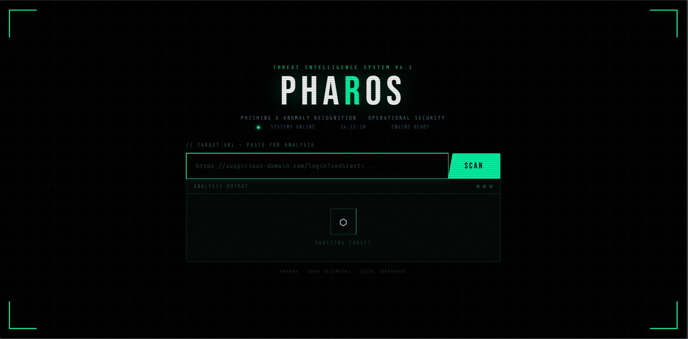
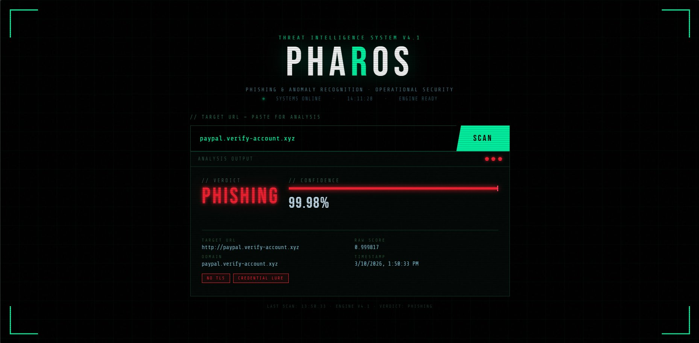

<div align="center">

```
██████╗ ██╗  ██╗ █████╗ ██████╗  ██████╗ ███████╗
██╔══██╗██║  ██║██╔══██╗██╔══██╗██╔═══██╗██╔════╝
██████╔╝███████║███████║██████╔╝██║   ██║███████╗
██╔═══╝ ██╔══██║██╔══██║██╔══██╗██║   ██║╚════██║
██║     ██║  ██║██║  ██║██║  ██║╚██████╔╝███████║
╚═╝     ╚═╝  ╚═╝╚═╝  ╚═╝╚═╝  ╚═╝ ╚═════╝ ╚══════╝
```

**Phishing & Anomaly Recognition · Operational Security**

<table>
<tr>
<td></td>
<td></td>
</tr>
<tr>
<td align="center"><sub>⬡ Awaiting Target</sub></td>
<td align="center"><sub>🔴 Phishing Detected · 99.98% Confidence</sub></td>
</tr>
</table>


[](https://phishing-detector-chi-green.vercel.app/)
[](https://phishing-detector-s0nb.onrender.com)
[](https://python.org)
[](https://fastapi.tiangolo.com)
[](https://xgboost.readthedocs.io)
[](LICENSE)

*A machine learning–powered threat intelligence system that detects phishing URLs in real time using lexical analysis, TF-IDF vectorization, and XGBoost classification — wrapped in a cybersecurity-grade dashboard.*

</div>

---

## 🎯 What is PHAROS?

PHAROS analyzes any URL and instantly classifies it as **Legitimate** or **Phishing** — with a confidence score and threat indicators. It combines structural URL features (length, hyphens, IP detection, suspicious keywords) with TF-IDF text vectorization, all served through a FastAPI backend and visualized in a tactical threat intelligence dashboard.

---

## 🌐 Live Demo

| Service | URL |
|---------|-----|
| 🖥️ Frontend Dashboard | [Open Dashboard](https://phishing-detector-chi-green.vercel.app/) |
| ⚡ Backend API | [API Endpoint](https://phishing-detector-s0nb.onrender.com) |
---

## ✨ Features

- 🤖 **XGBoost ML Model** — trained on real phishing + legitimate URL datasets
- 🔤 **Lexical Feature Extraction** — URL structure analysis without visiting the site
- 📊 **TF-IDF Vectorization** — token-level text features from URL strings
- 📡 **Real-time FastAPI Backend** — low-latency REST endpoint
- 🖥️ **Cyberpunk Threat Dashboard** — animated scan interface with confidence scoring
- 🧠 **SHAP Explainability** — model decision visualization
- 🏷️ **Threat Indicator Tags** — TLS check, IP detection, subdomain abuse, credential lures

---

## 🏗️ System Architecture

```
┌─────────────────────────────────────────────┐
│              User Input URL                 │
└──────────────────┬──────────────────────────┘
                   │
┌──────────────────▼──────────────────────────┐
│       Frontend Dashboard  (Vercel)          │
│         HTML · CSS · JavaScript             │
└──────────────────┬──────────────────────────┘
                   │  POST /predict  { url }
┌──────────────────▼──────────────────────────┐
│        FastAPI Backend  (Render)            │
└──────────────────┬──────────────────────────┘
                   │
         ┌─────────┴──────────┐
         │                    │
┌────────▼────────┐  ┌────────▼────────────┐
│    Structural   │  │   TF-IDF            │
│    Features     │  │   Vectorization     │
│  • URL length   │  │  • URL tokens       │
│  • Dot count    │  │  • Subword patterns │
│  • IP presence  │  │  • Path segments    │
│  • Keywords     │  │                     │
└────────┬────────┘  └────────┬────────────┘
         └─────────┬──────────┘
                   │
┌──────────────────▼──────────────────────────┐
│           XGBoost Classifier                │
└──────────────────┬──────────────────────────┘
                   │
┌──────────────────▼──────────────────────────┐
│    { prediction, probability }  returned    │
└─────────────────────────────────────────────┘
```

---

## 📁 Project Structure

```
phishing-detector/
│
├── app/                          # FastAPI backend
│   ├── main.py                   # API entry point & /predict endpoint
│   ├── feature_extractor.py      # URL feature engineering
│   └── requirements.txt
│
├── frontend/                     # Browser dashboard
│   ├── index.html                # PHAROS UI
│   └── script.js                 # API integration & rendering
│
├── model/                        # Trained artifacts
│   ├── phishing_model.pkl        # Scikit-learn pipeline
│   ├── xgb_model.pkl             # XGBoost classifier
│   ├── tfidf_vectorizer.pkl      # Fitted TF-IDF vectorizer
│   ├── struct_scaler.pkl         # Feature scaler
│   └── shap_full_summary.png     # SHAP explainability plot
│
├── training/                     # Model training pipeline
│   ├── train_model.py            # Training script
│   ├── generate_features.py      # Feature extraction pipeline
│   └── explain_model.py          # SHAP visualization
│
├── render.yaml                   # Render deployment config
├── requirements.txt
└── README.md
```

---

## 🤖 Machine Learning Model

### Algorithm
**XGBoost Classifier** — gradient boosted decision trees, optimized for tabular feature classification.

### Feature Engineering

**Structural Features (numerical)**

| Feature | Description |
|---------|-------------|
| `url_length` | Total character count of the URL |
| `dot_count` | Number of `.` separators |
| `hyphen_count` | Number of `-` characters |
| `has_ip` | Whether an IP address replaces the domain |
| `suspicious_keywords` | Presence of: `login`, `verify`, `secure`, `account`, `update` |
| `has_at_symbol` | Presence of `@` redirect trick |
| `subdomain_depth` | Number of subdomains |

**Text Features (TF-IDF)**
- URL tokenized into substrings and path segments
- Fitted TF-IDF vectorizer captures phishing vocabulary patterns

Structural features and TF-IDF features are concatenated before being passed to XGBoost.

---

## 🔬 Example Detection

**Input**
```
paypal.verify-account.xyz
```

**API Response**
```json
{
  "url": "paypal.verify-account.xyz",
  "prediction": "phishing",
  "probability": 0.9998
}
```

**Dashboard Output**
```
┌─────────────────────────────────────────┐
│  VERDICT      PHISHING                  │
│  CONFIDENCE   99.98%                    │
│                                         │
│  INDICATORS                             │
│  [ NO TLS ]  [ CREDENTIAL LURE ]       │
│  [ SUBDOMAIN ABUSE ]                    │
└─────────────────────────────────────────┘
```

---

## 🚀 Installation (Local)

**1. Clone the repository**
```bash
git clone https://github.com/CyberVortexX/phishing-detector.git
cd phishing-detector
```

**2. Create and activate virtual environment**
```bash
python -m venv venv

# Windows
venv\Scripts\activate

# macOS / Linux
source venv/bin/activate
```

**3. Install dependencies**
```bash
pip install -r requirements.txt
```

**4. Start the FastAPI server**
```bash
uvicorn app.main:app --reload --host 127.0.0.1 --port 8000
```

**5. Open the frontend**

Open `frontend/index.html` directly in your browser. No additional server required.

> ⚠️ **CORS** — If running the frontend as a local file, add this to `app/main.py`:
> ```python
> from fastapi.middleware.cors import CORSMiddleware
> app.add_middleware(CORSMiddleware, allow_origins=["*"], allow_methods=["*"], allow_headers=["*"])
> ```

---

## 📡 API Reference

### `POST /predict`

Classifies a URL as phishing or legitimate.

**Request**
```http
POST http://127.0.0.1:8000/predict
Content-Type: application/json
```
```json
{
  "url": "http://paypal.verify-account.xyz/login"
}
```

**Response**
```json
{
  "url": "http://paypal.verify-account.xyz/login",
  "prediction": "phishing",
  "probability": 0.9998
}
```

| Field | Type | Description |
|-------|------|-------------|
| `url` | `string` | The URL that was analyzed |
| `prediction` | `"phishing"` \| `"legitimate"` | Model classification |
| `probability` | `float` (0–1) | Confidence score of the phishing prediction |

---

## 🛠️ Tech Stack

| Layer | Technology |
|-------|------------|
| ML Model | XGBoost, Scikit-learn |
| Text Features | TF-IDF Vectorization |
| Explainability | SHAP |
| Backend | Python, FastAPI, Uvicorn |
| Frontend | HTML, CSS, Vanilla JavaScript |
| Backend Hosting | [Render](https://render.com) |
| Frontend Hosting | [Vercel](https://vercel.com) |

---

## 🔮 Future Improvements

- [ ] Domain reputation & WHOIS lookup
- [ ] URL blacklist / threat feed integration
- [ ] Chrome Extension — real-time in-browser detection
- [ ] Email phishing link scanner
- [ ] Historical scan log with exportable report
- [ ] Real-time global threat intelligence feed

---

## 👩‍💻 Author

**Ramya Patel**
*Cybersecurity & Machine Learning Enthusiast*

[](https://github.com/CyberVortexX)

---

<div align="center">

*Built with 🛡️ for the open-source security community*

</div>
